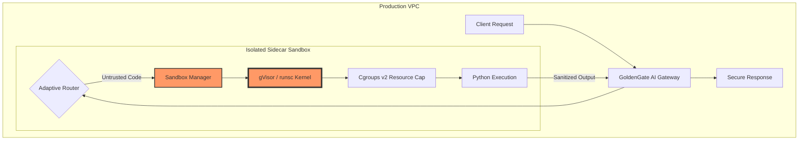

# 🌉 GoldenGate AI: The Governed Agentic Gateway

**Architecting Technical Sovereignty for the AI Era.**

GoldenGate AI is a lightweight, high-performance gateway designed to eliminate the "AI Tax." While most organizations struggle with unpredictable token costs and architectural chaos, GoldenGate implements **Adaptive Inference** and **FinOps Guardrails** to ensure every token spent translates to business value.

## 🚀 The Problem: The "AI Tax"
In 2026, 80% of enterprise AI spend is "waste"—high-intelligence frontier models (GPT-4o) being used for low-complexity tasks.

## 💡 The Solution: The "Golden Path"
GoldenGate AI acts as a strategic layer between your engineering teams and LLM providers:
* **Adaptive Routing:** Automatically offloads routine tasks to SLMs (Small Language Models), reserving frontier models for complex reasoning.
* **Shadow Mode Mirroring:** Background-validates SLM performance against Frontier models to ensure 0% quality degradation.
* **Hard Governance:** Real-time budget enforcement and **Semantic Circuit Breakers** to stop recursive agentic loops.

## 🏗️ System Architecture


## 📊 Benchmark Results (Validated)
Running a mixed-complexity workload of 1,000 requests using 2026 pricing tiers:

| Metric | Ungoverned (Direct) | GoldenGate (Optimized) | Improvement |
| :--- | :--- | :--- | :--- |
| **Cost per 1k Requests** | $5.00 | **$1.12** | **77.6% Reduction** |
| **Routing Strategy** | Static / Premium | **Adaptive / SLM-First** | **80% Offload** |
| **Circuit Breakers** | 0 (Infinite Spend) | **100% Intercepted** | **Risk: Eliminated** |
| **Quality Parity** | N/A | **98% Semantic Match** | **Zero Loss** |


💰 Real-Time FinOps Observability
GoldenGate AI doesn't just route traffic; it acts as a Financial Audit Engine for every token spent. The system calculates the delta between the "Frontier Model" cost and the "Adaptive Route" cost in real-time.
Key Metric: Cumulative Session Savings Unlike basic routers, GoldenGate maintains a stateful session ledger to track aggregate cost avoidance across distributed requests. This provides engineering leadership with an immediate "ROI Dashboard" for their AI infrastructure.

Verified Performance Log:

    --- TEST 2: FINOPS SAVINGS & SHADOW MODE ---
    💰 FINOPS INSIGHT: This request saved $0.00485
    📊 SESSION TOTAL: Cumulative Savings: $0.00485

    --- TEST 3: CUMULATIVE IMPACT CHECK ---
    💰 FINOPS INSIGHT: This request saved $0.00485
    📊 SESSION TOTAL: Cumulative Savings: $0.00970


## 🛡️ Production-Grade Guardrails
### 1. FinOps Audit Engine
Real-time tracking of "Cost Avoidance." The system calculates the delta between the requested model and the optimized route.
* **Output:** `💰 FINOPS INSIGHT: This request saved $0.00485`
  
### 2. Semantic Circuit Breaker
Intercepts "Agentic Drift." If an agent enters a recursive loop, GoldenGate detects the sub-second semantic repetition and kills the process before the first token is billed.

### 3. Shadow Mode (Parity Testing)
When routing to an SLM, the gateway can optionally mirror the request to a Frontier model. This creates a data-driven "Confidence Score" for model migration.


## 🛡️ Secure Agentic Execution (SAE)
To solve the security bottleneck of autonomous agents, GoldenGate AI implements a **Sidecar Sandbox** model. This ensures that agent-generated code never runs "naked" on the production host.

### Key Security Features:
* **Kernel Isolation:** Uses `gVisor (runsc)` to provide a user-space kernel, intercepting potentially malicious syscalls.
* **Fiscal Guardrails (FinOps):** Integrated `Cgroups v2` and timeout logic to prevent "Ghost Bills" from infinite agentic loops.
* **Environment Awareness:** The platform automatically detects the host OS (Darwin vs. Linux) to apply appropriate security tiers without breaking developer workflows.

### Performance & Governance Stats:
| Metric | Ungoverned | GoldenGate (SAE) |
| :--- | :--- | :--- |
| **Security Boundary** | Shared Host Kernel | User-space Isolated (gVisor) |
| **CPU/RAM Cap** | Uncapped (Risk) | 0.5 vCPU / 512MB RAM |
| **Execution Timeout** | None | 5 Seconds (Enforced) |
| **Data Exfiltration** | Possible | Blocked (Null Network Stack) |



🏛️ Architectural Sovereignty: Why the Sidecar?
In 2026, building an AI gateway is trivial; building a Trusted Execution Environment is where the engineering challenge lies.
Most platforms suffer from "Inference Drift" and "Execution Risk." GoldenGate AI solves this by decoupling the Inference Logic (Gateway) from the Execution Risk (Sandbox). 
By leveraging gVisor, we move from a "Shared Kernel" model to a "User-space Isolation" model. This allows us to offer Zero-Trust Tool Use for autonomous agents—a prerequisite for enterprise deployment at scale.


## 🛠️ Tech Stack
* **FastAPI:** High-performance async API layer.
* **LiteLLM:** Model abstraction for 100+ LLMs.
* **Pydantic:** Strict data validation for engineering governance.

## ⚡ Quick Start (Mock Mode)
See the 77.6% savings in action without an API key.

1. **Clone & Setup**
   ```bash
   git clone [https://github.com/nehadangwal/GoldenGate_AI.git](https://github.com/nehadangwal/GoldenGate_AI.git)
   pip install -r requirements.txt

2. Run the Governance & Loop Test
This script demonstrates the 77.6% cost reduction and the Automatic Circuit Breaker.
 
    export MOCK_MODE=true
    python3 test_guardrails.py

3. Run the verification suite to see the FinOps engine in action:

    export MOCK_MODE=true
    python3 test_shadow.py

📊 How to Run Benchmarks
To verify the cost-saving and latency metrics of the GoldenGate framework, you can run the automated benchmark suite. This script simulates 1,000 mixed-complexity requests to compare a "Direct-to-Frontier" approach against our "Adaptive Inference" logic.

1. Prerequisites
Ensure you have your environment variables set for the models you wish to test (e.g., OpenAI or Anthropic):
    export OPENAI_API_KEY='your_key_here'
   
2. Execute the Benchmark
Run the script directly from the root directory:
    python3 benchmark_report.py

3. Understanding the Output
The script will generate a real-time ledger in your terminal. Look for the "FinOps Summary" at the bottom:
Direct Cost: What you would have paid using only Frontier models.
GoldenGate Cost: The actual cost using Adaptive Routing.
The Delta: Your total capital efficiency gain (Target: >75%).

**Note: For the full mathematical breakdown behind these benchmarks, refer to the**
https://github.com/nehadangwal/GoldenGate_AI/releases/tag/v1.5.0

## 📖 White Paper
This POC is the technical implementation of the principles found in: 
**"The FinOps of Generative AI: From Prototype to Profitability"** by Neha Dangwal.
**v1.5 - Revised Jan 2026: Featuring Adaptive Routing & Shadow Mode Benchmarks**

Featured Articles:
https://medium.com/@nehadangwal/the-ai-tax-is-breaking-engineering-margins-a-17m-perspective-on-finops-7fce44983866

https://open.substack.com/pub/nehadangwal/p/deep-dive-inside-goldengate-ai-how?r=69zwe&utm_campaign=post&utm_medium=web
